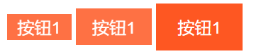

# button 按钮

按钮组件可以指定到`<button>`或`<a>`上。

例子代码：



```html
<button class="si-btn-small si-bg-deep-orange si-fg-white si-decor-orange">按钮1</button>
<button class="si-btn si-bg-deep-orange si-fg-white si-decor-orange">按钮2</button>
<button class="si-btn-large si-bg-deep-orange si-fg-white si-decor-orange">按钮3</button>
```

* `si-btn-small`：小按钮
* `si-btn`：正常按钮
* `si-btn-large`：大按钮

注意按钮颜色的指定，这些用到了调色盘中的颜色属性，为按钮分别指定背景色、前景色、装饰色（边框颜色）。