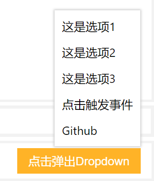

# dropdown 下拉框

下拉框可以在一定程度上取代比较丑而且不可定制的`<select>`组件，该组件可以引入JavaScript控制下拉框的显示位置和显隐切换。

例子：



```html
<div id="dropdown" style="display: none" class="si-dropdown si-bg-white si-fg-black">
    <ul>
        <li>这是选项1</li>
        <li>这是选项2</li>
        <li>这是选项3</li>
        <li onclick="handleDropdownClick()">点击触发事件</li>
        <li><a href="https://github.com">Github</a></li>
    </ul>
</div>
```

* `si-dropdown`：用它包裹下拉框布局结构

```javascript
// 初始化Dropdown组件
let dropdown = new silicon.Dropdown({
    domId: 'dropdown',
    relativeDomId: 'trigger-dropdown'
});
// 显示和隐藏的切换
document.getElementById('trigger-dropdown').addEventListener('click', function () {
    dropdown.toggleDropdown();
});
// 实现根据鼠标点击位置判断是否隐藏下拉框
document.body.addEventListener('mousedown', function (ev) {
    let check = dropdown.checkPosWithRelativeNode({'x': ev.clientX,'y': ev.clientY});
    if (!check) {
        dropdown.hideDropdown();
    }
}, false);
```

Dropdown构造参数：

* `domId`：下拉框div的`id`
* `relativeDomId`：触发下拉框弹出的那个按钮的`id`

Dropdown可用函数：

* `showDropdown()`：显示下拉框
* `hideDropdown()`：隐藏下拉框
* `toggleDropdown()`：切换下拉框显示和隐藏
* `checkPos({x, y})`：检查给定坐标是否在下拉框div区域中
* `checkPosWithRelativeNode({x, y})`：检查给定坐标是否在下拉框div和触发按钮区域中
