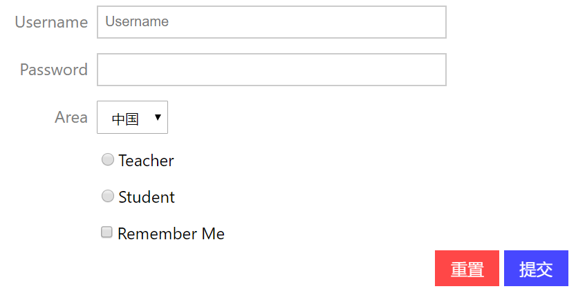

# form 表单

表单用于处理用户输入，siliconUI只是对样式进行了简单的封装，具体的处理逻辑还是得你自己发挥。

例子代码：



```html
<form class="si-form">
    <div class="si-form-input">
        <label for="username">Username</label>
        <input type="text" id="username" name="username" placeholder="Username"/>
    </div>

    <div class="si-form-input">
        <label for="password">Password</label>
        <input type="password" id="password" name="password"/>
    </div>

    <div class="si-form-select">
        <label for="area">Area</label>
        <select name="area" id="area">
            <option value="China">中国</option>
            <option value="other">外国</option>
        </select>
    </div>

    <div class="si-form-radio">
        <label for="teacher"></label>
        <input type="radio" name="type" id="teacher"/>Teacher
    </div>

    <div class="si-form-radio">
        <label for="student"></label>
        <input type="radio" name="type" id="student"/>Student
    </div>

    <div class="si-form-checkbox">
        <label for="remember"></label>
        <input type="checkbox" name="remember" id="remember"/>Remember Me
    </div>

    <div style="text-align: right">
        <input type="submit" value="重置" class="si-btn si-bg-red-lighten-2 si-fg-white si-decor-pink"/>
        <input type="submit" value="提交"
               class="si-btn si-bg-blue-lighten-2 si-fg-white si-decor-light-blue"/>
    </div>
</form>
```

* `si-form`：用它包裹表单组件
* `si-form-input`：表单输入框
* `si-form-select`：表单下拉选择框
* `si-form-radio`：表单单选框
* `si-form-checkbox`：表单复选框
