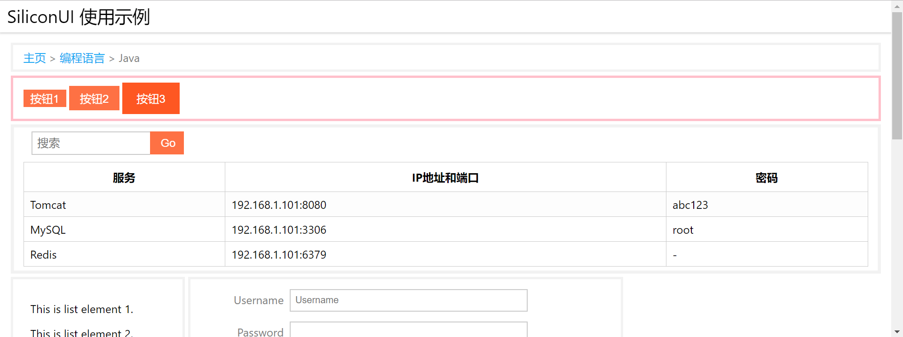

# header 页头导航栏

页头导航栏提供了一个页头样式，它会永远固定在页面顶部。其内部的样式需要自行编写。

例子：



注：图中最顶部

```html
<div class="si-header si-bg-white-lighten-2">
    <div style="font-size: 25px; margin-top: 5px; margin-left: 10px">SiliconUI 使用示例</div>
</div>
```

* `si-header`：用它包裹作为页头的div

注意：不要把页头的div写到`si-container`里面。
