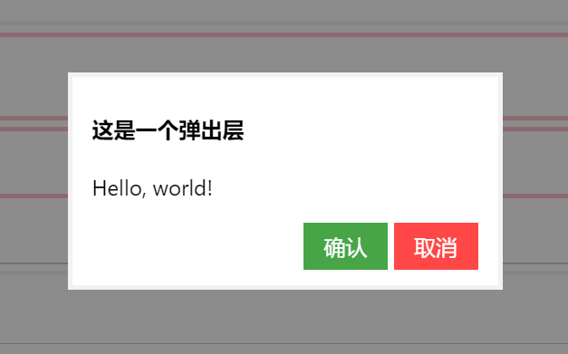

# layer popup 弹出层

该组件用于在页面上弹出一个模态对话框，对话框的具体布局需要你自己写，这里只是对遮罩和对话框的容器进行了简单的封装。该组件的显示隐藏可以通过JavaScript组件实现。

例子：



```html
<div id="layer" style="display: none;" class="si-layer si-bg-black-lighten-4">
    <div class="si-popup si-bg-white" style="width: 320px; height: 160px">
        <h4>这是一个弹出层</h4>
        <p>Hello, world!</p>
        <div style="text-align: right">
            <button class="si-btn si-bg-green-lighten-2 si-fg-white">确认</button>
            <button class="si-btn si-bg-red-lighten-2 si-fg-white">取消</button>
        </div>
    </div>
</div>
```

* `si-layer`：将该属性指定给遮罩层，遮罩色可以通过调色板属性指定，一般都是透明色
* `si-popup`：将该属性指定给弹出的对话框，它的作用类似panel组件，提供一个统一的容器样式

使用JavaScript控制显示隐藏：

```javascript
// 初始化layerPopup组件
let layerPopup = new silicon.LayerPopup({
    domId: 'layer'
});
// 按P键显示隐藏layerPopup组件
document.body.addEventListener('keydown', function (ev) {
    if (ev.keyCode === 80) {
        layerPopup.toggleLayerPopup();
        ev.preventDefault();
    }
}, false);
```

LayerPopup构造参数：

* `domId`：加载中div的`id`

LayerPopup可用函数：

* `showLayerPopup()`：显示模态对话框遮罩
* `hideLayerPopup()`：隐藏模态对话框遮罩
* `toggleLayerPopup()`：切换模态对话框遮罩
