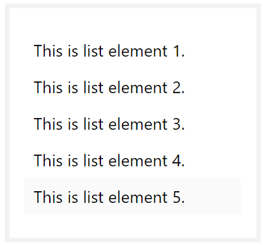

# list 列表

列表用于展示一列数据，也可以用来当作列表导航使用。

例子：



下面代码中为了显示效果，在最外面套了一层`panel`容器。

```html
<div class="si-panel si-bg-white" style="width: 20%; margin-top: 5px; float: left">
    <ul class="si-list">
        <li>This is list element 1.</li>
        <li>This is list element 2.</li>
        <li>This is list element 3.</li>
        <li>This is list element 4.</li>
        <li><a href="#">This is list element 5.</a></li>
    </ul>
</div>
```

* `si-list`：用它包裹作为列表的`<ul>`元素
