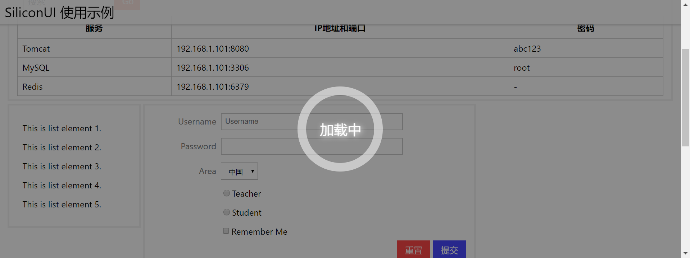

# loading 加载遮罩层

该组件显示一个动感的加载中特效，以遮罩层的形式弹出。该组件的显示隐藏切换功能需要JavaScript文件支持，你也可以自己编写。

例子：



```html
<div id="loading" style="display: none" class="si-loading si-fg-white si-decor-white si-bg-black-lighten-4">
    <div class="si-loading-ring"></div>
    <div class="si-loading-txt">
        <span>加载中</span>
    </div>
</div>
```

* `si-loading`：用它包裹加载中的遮罩div
* `si-loading-ring`：该属性标明加载中效果的动态环
* `si-loading-txt`：该属性标明加载中文字

使用JavaScript控制显示隐藏：

```javascript
// 初始化loading组件
let loading = new silicon.Loading({
    domId: 'loading'
});
// 按SPACE键显示隐藏loading组件
document.body.addEventListener('keydown', function (ev) {
    if (ev.keyCode === 32) {
        loading.toggleLoading();
        ev.preventDefault();
    }
}, false);
```

Loading构造参数：

* `domId`：加载中div的`id`

Loading可用函数：

* `showLoading()`：显示加载中遮罩
* `hideLoading()`：隐藏加载中遮罩
* `toggleLoading()`：切换加载中遮罩
