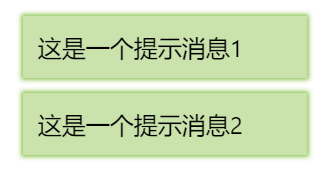

# notice 通知

通知用于消息提示等场景。该组件只封装了样式，具体的弹出逻辑需要自行编写。

例子：



```html
<div class="si-notice-container">
    <div class="si-notice si-bg-light-green-lighten-4 si-decor-light-green">这是一个提示消息1</div>
    <div class="si-notice si-bg-light-green-lighten-4 si-decor-light-green">这是一个提示消息2</div>
</div>
```

* `si-notice-container`：它是一个`position: fixed`的容器
* `si-notice`：具体的一条消息的封装，可以用调色板属性为其指定颜色
