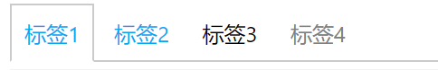

# tab 标签页

标签页用来组织多个平行关系的文档。

例子：



```html
<ul class="si-tab">
    <li class="si-tab-item si-tab-item-active"><a href="#">标签1</a></li>
    <li class="si-tab-item"><a href="#">标签2</a></li>
    <li class="si-tab-item">标签3</li>
    <li class="si-tab-item si-tab-item-disabled">标签4</li>
</ul>
```

* `si-tab`：将该属性指定给标签组的`<ul>`标签
* `si-tab-item`：将该属性指定给标签组的`<li>`元素标签
* `si-tab-item-active`：该属性指定当前激活的标签组
* `si-tab-item-disabled`：该属性指定禁止使用的标签组
