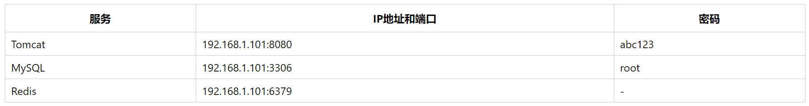

# table 表格

表格用于展示数据。

例子：



```html
<table class="si-table">
    <tr>
        <th>服务</th>
        <th>IP地址和端口</th>
        <th>密码</th>
    </tr>
    <tr>
        <td>Tomcat</td>
        <td>192.168.1.101:8080</td>
        <td>abc123</td>
    </tr>
    <tr>
        <td>MySQL</td>
        <td>192.168.1.101:3306</td>
        <td>root</td>
    </tr>
    <tr>
        <td>Redis</td>
        <td>192.168.1.101:6379</td>
        <td>-</td>
    </tr>
</table>
```

* `si-table`：为`table`标签指定该属性
